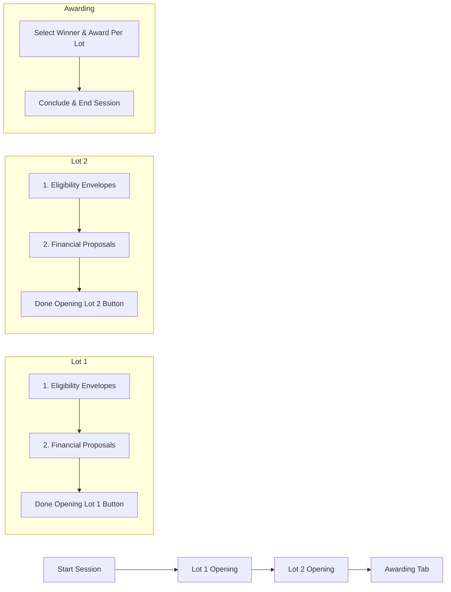

# Restructure Bid Session to Lot-by-Lot Opening Flow & Awarding Tab

Restructure `bid_session.php` so that bid opening proceeds lot by lot (e.g., Lot 1 -> Lot 2 -> Awarding) rather than opening all lots' eligibility envelopes before moving to financial proposals.

## Proposed User Flow

## User Review Required

> [!IMPORTANT]
> - **Top-Level Tabs**: Directly below the procurement hero, a master tab bar will display `Lot 1` -> `Lot 2` -> ... -> `Awarding`.
> - **Per-Lot Two-Stage Opening**:
>   1. **Eligibility Stage**: Review all bidders' eligibility files for this lot.
>   2. **Financial Stage**: Review financial proposals of all eligible/qualified bidders for this lot (disqualified bidders remain visible in the tab list as grayed-out with a red `Disqualified` badge and skipped from opening).
> - **"Done Opening Lot #" Action**: A prominent button at the bottom of the lot view triggers a confirmation modal to seal the lot and unlock/advance to the next lot (or the Awarding tab).
> - **Awarding Tab**: Allows declaring the winning bidder and awarded amount per lot, then concluding the session.

---

## Proposed Changes

### Frontend UI & Logic

#### [MODIFY] [bid_session.php](file:///c:/xampp/htdocs/YesParency/admin/bid_session.php)
- **Master Navigation Tabs**:
  - Replace separate stacked phase panels with a primary top navigation bar: `Lot 1`, `Lot 2`, ..., `Awarding`.
  - Include lot badges, completion checkmarks, and locked/unlocked state indicators.
- **Active Lot Panel**:
  - Show lot details (Lot number, Title, ABC).
  - Sub-phase indicator: **Stage 1: Eligibility & Technical Review** -> **Stage 2: Financial Proposal Review**.
  - Bidder tabs with avatars, active indicators, and grayed-out `.disqualified` badges.
  - Password modal for document decryption.
  - Evaluation checklist modal (Eligible / Disqualify for Stage 1; Compliant / Non-Compliant for Stage 2).
  - Bottom action: **"Done Opening Lot #[N]"** button with confirmation modal `doneLotModal`.
- **Awarding Tab Panel**:
  - Unlocked when all lots have finished opening (or directly viewable).
  - Shows each lot with its eligible/qualified contenders.
  - Winner declaration input (₱ awarded amount) and "Declare Winner" modal.
  - Final "Conclude & End Session" button with confirmation modal.
- **Sidebar Milestones**:
  - Update progress list to dynamically reflect `Lot 1`, `Lot 2`, ..., `Awarding`, and `Session Ended`.

---

### Backend API

#### [MODIFY] [bid_session_api.php](file:///c:/xampp/htdocs/YesParency/admin/bid_session_api.php)
- Ensure endpoints handle per-lot stages smoothly:
  - `bidders`: Returns all bidders per lot and phase with `disqualified` flag accurately computed.
  - `set_eligible`: Updates bid status and lot qualification.
  - `set_lot_done`: Action to track completed lots in the database/session.
  - `award_lot`: Records winning bidder and amount in `awards` table.
  - `end_session`: Concludes the session and updates procurement status.

---

## Verification Plan

### Manual Verification
1. **Start Session**: Open a scheduled session in the admin panel and click "Start Session".
2. **Lot 1 Evaluation**:
   - Verify Lot 1 is active, with Stage 1 (Eligibility).
   - Open and decrypt files for Bidder 1, mark as Eligible.
   - Open and decrypt files for Bidder 2 (or mark Disqualified).
   - Check that disqualified bidders turn gray with a red `Disqualified` badge and file opening is skipped.
   - Verify transition to Stage 2 (Financial) for qualified bidders.
   - Open and decrypt financial proposals.
3. **Lot Completion**:
   - Click "Done Opening Lot #1", verify the confirmation modal appears.
   - Confirm, verify Lot 1 gets marked done with a check icon, and Lot 2 becomes active.
4. **Lot 2 & Awarding Transition**:
   - Complete Lot 2 and click "Done Opening Lot #2".
   - Confirm, verify automatic progression to the **Awarding** tab.
5. **Awarding & Conclude**:
   - Select winning bidder for Lot 1 and Lot 2 with awarded amount.
   - Click "Conclude & End Session", verify session ends cleanly and updates database.
